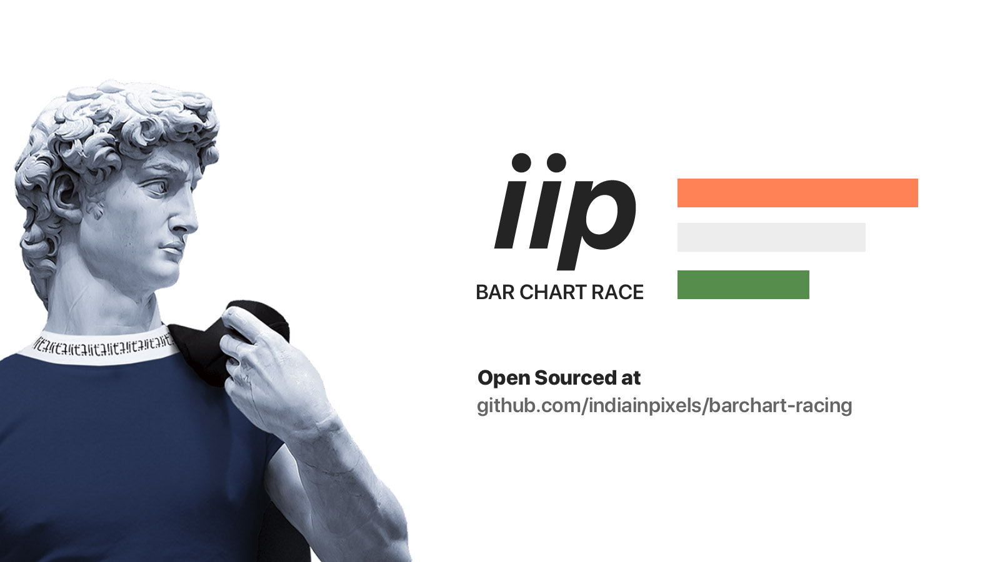

# India in Pixels Bar Chart Racing

For over two years, this nifty code base powered India in Pixels' [YouTube channel](https://youtube.com/indiainpixels) with videos fetching over millions of views in cricket, economy and culture.

## How to use it?

Download the code base. You only should have to modify `data.json` in the same format as presented in the example. If you have your data as a google spreadsheet, you can use a website like [csv2json](https://csvjson.com/) to convert it into JSON.

If you wish to delve deeper into customizing color and speed, you can easily experiment changing variables in `Timeline.js`

The project uses the wonderful [p5.js](https://p5js.org/) to do most of the visualization.

## Why are you doing this?

I feel India in Pixels has received a lot of love and support from its community. It has grown thanks to the open source data that several government and private organisations have made freely available. Now that India in Pixels is no longer making bar chart racing videos (and has shifted to more narration like styles), it feels to give the code base back to the community so that some young creative nerd can make good use of it.

If this codebase helps you in any form, you can support IIP via UPI: indiainpixels@paytm if you are in India or Patreon at [Patreon](https://patreon.com/indiainpixels) if you are overseas

## LICENSE

Open sourced under MIT License

## Request for collaborators

The code so far was used for personal use, so it is written in a well, haphazard fashion. If you are interested in improving the code quality, you are most welcome to fork the repo and submit a Pull Request.

## Authors

[Ashris](https://iashris.com)
